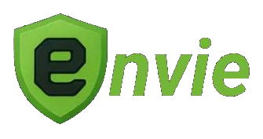

<div align="center">



*Keep your secrets and environment variables secure and organized.*

</div>

Envie is both a secret manager for production use and a developer tool for better management of environment variables. Declutter and secure your developer machine by eliminating the need for local `.env` files.

### Features

- **Always encrypted**  
Environment variables are encrypted before transit and never visible to the server

- **Fine-grained access control**  
Grant access to specific environments on a per-user basis, optionally with time limits

- **Version history**  
Track changes to environment configurations over time. Rollback to previous and see an audit trail of changes

- **Variable groups**  
Group and organize environment variables together with shared access control rules. 

- **Multi-tenant organizations**  
Support for teams with role-based permissions


### Roadmap

○ [**Web UI**](https://github.com/ilmari-h/envie/discussions/7)  
│ Manage environments through a browser interface  
│  
○ [**Deployment Automation**](https://github.com/ilmari-h/envie/discussions/5)  
│ Trigger deployments when environment variables are updated  
│  

You can suggest features and discuss the roadmap in [discussions](https://github.com/ilmari-h/envie/discussions).

## 📦 Installation

Envie is available as a CLI tool on npm.

To install it globally on your machine, run:

```
npm install -g @envie/cli
```

Requirements: Node.js (v22.0 and up) and Linux or macOS operating system

## 🚀 Quick start guide
> [!IMPORTANT]  
> To use Envie, you need an Ed25519 keypair on your machine. This is because Envie uses client-side encryption to secure your environment variables.
> 
> You can generate a new one using OpenSSH with the following command:
> 
> ```
> ssh-keygen -t ed25519
> ```

When using Envie for the first time, run the command `envie` without arguments to bring up a setup wizard.

This wizard will help you with the initial configuration: setting up your keypair path and terminal auto complete.

Once you have run the setup wizard you can login by running:

```
envie login
```

Now you are ready to use Envie!

### Creating a project

Envie organises different environments under projects.

**Example:** Acme corporation has 2 projects: web dashboard and a REST API.

First, Acme corporation developer creates an organization called *acme* using the command:

```
envie organization create acme
```

> [!TIP]  
> When using the free plan of Envie cloud, you can use your personal organization instead of creating one.
> 
> Find the name of your personal organization by running
> 
> ```
> envie organization list
> ```

Then, time to create projects for the web dashboard and API:

```
envie project create acme:web-dashboard && \
envie project create acme:rest-api
```

You can list the projects under the Acme organization by running:

```
envie project list --organization acme
```

### Replacing your local .env files with Envie environments

Instead of local *.env* files you can manage your environment variables with Envie environments.

Under the same project, you can have as many environments as you want. For example, one called `prod` for production use, `staging` for staging and one called `josh-dev` for the personal dev environment of a developer called Josh.
All of these can have different access control rules (more on that later).

You can create an environment from an existing *.env* file on your disk with:

```bash
envie environment create <organization>:<project>:<environment-name> <path-to-env-file>
```

Or if you already have an environment and want to update it from a *.env* file on your disk
```bash
envie environment update <organization>:<project>:<environment-name> <path-to-env-file>

```

You can also update a single environment variable at a time with:

```bash
envie set <organization>:<project>:<environment-name> KEY=value

# or
envie set <organization>:<project>:<environment-name> KEY value

# or copy from another environment
envie set <organization>:<project>:<environment-name> KEY org:project:other-env
```

To remove an environment variable, run:
```bash
envie unset <org>:<project>:<env-name> KEY
```

### Using your environments

Instead of sourcing a local .env file you can run any command with Envie using your chosen environment.

Execute a command with environment variables loaded:
```bash
envie exec <organization>:<project>:<environment-name> ./your-command.sh

# or specify a version
envie exec <organization>:<project>:<environment-name>@version ./your-command.sh

# or no command to run an interactive shell
envie exec <organization>:<project>:<environment-name>

# use -- to pass arguments to the command
envie exec <organization>:<project>:<environment-name>@version npm -- run dev
```

### Workspace configurations with `envierc.json`

You can create a project specific configuration for Envie by adding an `envierc.json` file inside your project directory.

Example of an `envierc.json`
```json
{
  "organizationName": "acme",
  "projectName": "acme-web-application",
  "instanceUrl": "https://api.envie.cloud"
}
```

When running commands inside a directory with an `envierc.json` file, like `envie exec`, you don't need to specify the full path to the environment (e.g. instead of _acme:acme-web-application:dev_ you can just specify _dev_).

### Different dev environments for different developers with a `.envie` file

When you have multiple developers working on the same project, each one of them can specify their own environment using a `.envie` file.

Place the `.envie` file at the root of your project and add it to your `.gitignore`

Inside the file specify your dev environment e.g. `acme-corp:project-name:joshs-dev-env`.

Now when using `envie exec` with `default` argument for the environment e.g. `envie exec default ./some-command.sh`

Envie will read the environment name from the developer-specific `.envie` file.

### Example configuration with `package.json`

You can easily integrate envie with any development setup.
For example, here's how to use envie in a web development project together with scripts in your `package.json` file.

1. Create an `envierc.json` file in your project root

2. Specify your personal default dev environment in `.envie` file.

3. Prefix your `package.json` development scripts with `envie exec` like so:

```json
{
  "name": "my-project",
  "version": "0.1.0",
  "private": true,
  "type": "module",
  "scripts": {
    "build": "npx with-env next build",
    "dev": "npx with-env next dev --turbo",
    "start": "npx with-env next start",
    "with-env": "envie exec default --"
  },
  "dependencies": {
    /*...*/
  }
}
```

Now when running e.g. `npm run dev` the command will run with your specified environment.

## Configuration

Envie configuration can be managed via the CLI (see `envie config` subcommands).

Local configuration can also be managed via a `config.json` file, stored under the standard configuration directory if your operating system (`XDG_CONFIG_HOME/envie` for Linux and `~/Library/Application Support/envie` for macOS.) You can override this with the environment variable `ENVIE_CONFIG_DIRECTORY`.

## Self Hosting
> [!TIP]  
> Not into self hosting? Envie Cloud offers a hosted instance that is **free forever** for individual use with affordable per-user licensing available for teams.
>
> Head over to <https://envie.cloud> and sign up to get started with a forever-free plan!


Envie can be self-hosted using Docker. Two images are required:

- **API**: [salhdev/envie-api](https://hub.docker.com/r/salhdev/envie-api)
- **Web client**: [salhdev/envie-web](https://hub.docker.com/r/salhdev/envie-web)

Image usage documented on Docker hub.

## Security Practices

Envie uses public key encryption to ensure your environment variables stay private and secure:

### How It Works
- **Client-side encryption** - Your environment variables are encrypted on your device before being sent anywhere
- **Public key encryption** - Uses modern cryptography so only people you give access to can decrypt your data
- **Zero-knowledge server** - The server stores encrypted data but can never see your actual environment variables

### Access Control
- **Fine-grained permissions** - Grant access to individual environments, not just entire projects
- **Role-based access** - Organization admins can manage who can create projects and environments
- **Explicit access only** - Users must be explicitly granted access to each environment they need
- **Time-limited access** - Automatically revoke access after a given period of time

### Public Key Encryption

Your environment variable values are stored encrypted on the server (that is, in the database of your Envie API instance).
To allow your selected team members to access and decrypt it, Envie uses X25519 Diffie–Hellman key exchange protocol.

When you create an environment, a data encryption key (DEK) is generated on the client.
For each user that has access to this environment, an encrypted version of the DEK is stored on the server.
This encrypted DEK can only be decrypted with that user's keypair.

This approach is widely adopted in other applications.
For example, ***dotenvx*** is another environment variable management solution that uses this approach. You can find their whitepaper at <https://dotenvx.com/dotenvx.pdf>.

## Architecture

This is a TypeScript monorepo built with Turborepo containing:

### Applications
- **API Server** (`apps/api/`) - Express.js REST API with JWT authentication
- **CLI Tool** (`apps/cli/`) - Command-line interface for managing environments
- **Web Interface** (`apps/web/`) - Web UI


## Development prerequisites
- Bun >= 1.2.11
- PostgreSQL database
- Redis instance
- GitHub OAuth application
